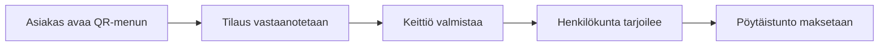

# Ravintola POS – Frontend

Ravintolan kassamyynti, asiakkaan QR-tilaukset ja keittiön tilauskäsittely samassa järjestelmässä. Tämä portfolio-projekti sisältää henkilökunnan kassa-, tarjoilija- ja keittiönäkymät sekä asiakkaan mobiilikäyttöön sopivan QR-menun.

**Lähdekoodiversio: [v2.0.1](https://github.com/AlexNtrx/pos-restaurant-nextjs/releases/tag/v2.0.1)** · [Backend](https://github.com/AlexNtrx/pos-restaurant-backend) · [Frontend-sovellus](https://pos-restaurant-nextjs.vercel.app)

## Mitä sovellus tekee?

- Kassa: paikan päällä ruokailu ja takeaway, annosvalinnat, maksut, kuitit ja uudelleentulostus.
- Asiakas: QR-menu ilman kirjautumista, ostoskori, tilausseuranta ja henkilökunnan kutsuminen.
- Henkilökunta: tilausten vastaanotto, pöytäistunnot, tarjoilijan tilaukset ja keittiön työjono.
- Ylläpito: ruokalista, henkilöstö, ravintolan asetukset, kuitti- ja tilaushistoria sekä myyntiraportit.
- Peruutukset: valmistusta edeltävät peruutukset ja ylläpitäjän vahvistamat manuaaliset palautukset.

### Esimerkkityönkulku: QR-tilaus



Uusi kassatilauksen luonnos maksetaan ennen keittiöön lähettämistä. QR- ja tarjoilijatilaukset voidaan maksaa myöhemmin.

## Teknologiat ja suunnitteluratkaisut

Next.js 16, React 19, TypeScript, Tailwind CSS 4, Radix UI, Axios ja Vitest. Käyttöliittymä on suomenkielinen.

- **Palvelimen vahvistama maksu:** selain lähettää tuotevalinnat; backend tarkistaa hinnat ja summat.
- **Epävarman pyynnön palautus:** maksu- ja tilausyritykset säilyttävät saman idempotenssiavaimen, jotta verkkokatkon jälkeen voidaan tarkistaa sama tapahtuma.
- **Rajatut listat ja kyselyt:** historia ladataan sivuittain, ruokalistan näyttömäärä on rajattu ja tilausten kyselyt huomioivat välilehden näkyvyyden sekä yhteyden palautumisen.
- **Featurekohtainen rakenne:** sivut kokoavat työnkulun, komponentit näyttävät käyttöliittymän ja hookit hallitsevat tilaa sekä elinkaarta.

## Koodin sijainnit

| Muutettava alue                                | Sijainti                                            |
| ---------------------------------------------- | --------------------------------------------------- |
| Kassa, ostoskori ja checkout                   | `app/backoffice/sale/`                              |
| Tarjoilija ja keittiö                          | `app/backoffice/waiter/`, `app/backoffice/kitchen/` |
| Tilausten vastaanotto ja historia              | `app/backoffice/orders/`                            |
| Ruokalista, asetukset ja henkilöstö            | `app/backoffice/catalog/`, `settings/`, `staff/`    |
| Asiakkaan QR-näkymät                           | `app/order/[tableToken]/`                           |
| Yhteinen maksu- ja kuittikäyttöliittymä        | `components/payments/`, `components/receipts/`      |
| Order- ja QR-sopimukset, API-luku ja tallennus | `lib/orders/`, `lib/qr/`                            |
| Regressiotestit                                | `test/`                                             |

Featurejen `_components/` sisältää paikallisen käyttöliittymän, `_hooks/` tilan ja elinkaaren sekä `_lib/` paikalliset tyypit ja apufunktiot. API-pyynnöt käyttävät yhteistä `lib/api.ts`-asiakasta.

## Käynnistys paikallisesti

Tarvitset Node.js 24:n, npm:n, käynnissä olevan backendin ja aktiivisen henkilökuntatunnuksen. Käyttäjätilit luodaan backendin kautta.

```bash
git clone https://github.com/AlexNtrx/pos-restaurant-nextjs.git
cd pos-restaurant-nextjs
npm ci
```

Luo `.env.local` projektin juureen:

```dotenv
NEXT_PUBLIC_API_SERVER=http://localhost:3001
```

Arvo on backendin origin ilman `/api`-polkua. Sovellus lisää polun itse. `NEXT_PUBLIC_*`-arvot päätyvät selaimeen, joten niihin ei saa lisätä salaisuuksia.

Käynnistä backend sen [README-ohjeilla](https://github.com/AlexNtrx/pos-restaurant-backend#readme) ja frontend:

```bash
npm run dev
```

Avaa [localhost:3000/signin](http://localhost:3000/signin). Roolit ovat `admin`, `kassa`, `waiter` ja `kitchen`; backend tarkistaa aktiivisen tilin oikeudet jokaisessa suojatussa pyynnössä.

## Tarkistukset ja julkaisuversio

```bash
npm test
npm run typecheck
npm run lint
npm run format:check
```

Tuotantokäännös vaatii `NEXT_PUBLIC_API_SERVER`-arvoksi todellisen HTTPS-originin, joka ei ole localhost. Korvaa kehitysosoite ennen käännöstä; sekä `npm run build` että `npm run build:release` hylkäävät paikallisen HTTP-osoitteen.

```bash
npm run release:check
npm run build:release
```

Tarkistus vahvistaa osoitteen muodon, ei API:n tavoitettavuutta, TLS:ää tai CORS-asetuksia. Julkinen API-origin sisältyy rakennettuun frontend-versioon.

Refaktorointivaiheessa tarkistettu: **279 testiä**, TypeScript ja tuotantokäännös. ESLintissä jäi yksi olemassa oleva testitiedoston varoitus. Tämä ei ole tuotannon selain-E2E-hyväksyntä.

## Rajaukset ja tila

- Ostoskoriluonnokset tallennetaan selaimeen eivätkä synkronoidu laitteiden välillä.
- Tilauspäivitykset käyttävät kyselyitä; reaaliaikaista toimitusta ei ole toteutettu.
- Pöytäistunnolla on yksi lasku; laskun jakamista ei ole toteutettu.
- Palautus kirjaa henkilökunnan vahvistaman käteis- tai pankkipalautuksen; sovellus ei siirrä rahaa.
- Asiakastilejä, verkkomaksuja, toimituksia, varastonhallintaa, pöytävarauksia ja kanta-asiakasohjelmaa ei ole toteutettu.

Lähdekoodijulkaisu ja linkki sovellukseen eivät yksin vahvista käyttöönotetun version tuotantovalmiutta. Tuotantotarkistukset ja pilotin hyväksyntä ovat kesken. Refaktorointierälle ei tehty uutta selain-E2E-tarkistusta.

Frontend ja backend julkaistaan yhteensopivana parina: [Frontend v2.0.1](https://github.com/AlexNtrx/pos-restaurant-nextjs/releases/tag/v2.0.1) · [Backend v2.0.1](https://github.com/AlexNtrx/pos-restaurant-backend/releases/tag/v2.0.1).
